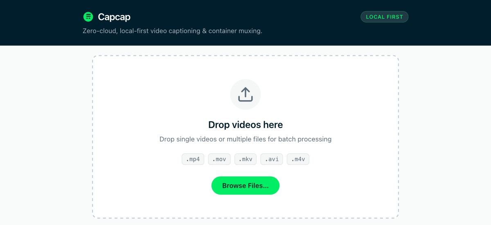

# Capcap

**Zero-cloud, local-first video captioning and container muxing.**

<p align="center">
  
</p>

Capcap transcribes speech in your videos locally on your machine using an embedded Whisper model. No cloud servers, no subscriptions, no accounts, no limits, (e.g. you can caption that 1939 serbian movie) and no network required.

---

## Features

- **100% Offline & Private** — Audio never leaves your computer; speech transcription runs locally.
- **Fast Stream-Copy Muxing** — Embeds captions directly into the container without re-encoding video.
- **Sidecar & Embedded Subtitles**:
  - `.mp4` / `.mov` → Native `mov_text` subtitle track (compatible with QuickTime and Apple devices).
  - `.mkv` → Native SRT subtitle stream.
  - Other containers (e.g. `.avi`) → `.srt` sidecar file only.
- **Batch Processing** — Transcribe and mux multiple videos in one go, from either the GUI or CLI.
- **Dual Interface** — Drag-and-drop desktop app or command-line tool.

---

## Installation

### Homebrew (macOS / Linux)

```bash
# Tap the repository
brew tap matheusbuniotto/caption-captain https://github.com/matheusbuniotto/caption-captain

# Install the CLI
brew install capcap

# Or install the Desktop App (macOS)
brew install --cask capcap
```

### Quick Install (macOS / Linux Shell)

```bash
curl -fsSL https://raw.githubusercontent.com/matheusbuniotto/caption-captain/master/scripts/install.sh.tmpl | bash
```

### Prebuilt Binaries

Download standalone executables and macOS `.dmg` bundles directly from the [latest release](../../releases/latest).

---

## Usage

### Desktop App

1. Launch **Capcap**.
2. Drag and drop one or more video files into the window (or click **Browse Files…**).
3. *(Optional)* Set a language code override (e.g. `en`, `pt`, `es`) or leave blank to auto-detect.
4. Click **Start Captioning**.

> **macOS Note**: The app is currently unsigned. On first launch, right-click (or Control-click) `Capcap.app` in Finder, click **Open**, and confirm in the dialog. You only need to do this once.

---

### Command Line

```bash
# Caption a single video
capcap run video.mp4

# Process multiple videos in batch
capcap run video1.mp4 video2.mkv video3.mov

# Specify spoken language (skips auto-detection)
capcap run video.mp4 --lang en

# Generate only the .srt sidecar (skip embedding)
capcap run video.mp4 --no-embed

# Launch the desktop GUI from the terminal
capcap gui
```

Outputs (`video.srt` and `video.captioned.mp4`) are created right next to your original files. Original videos are never modified.

---

## License

MIT
