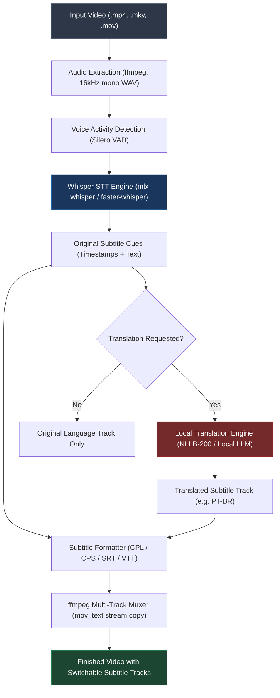
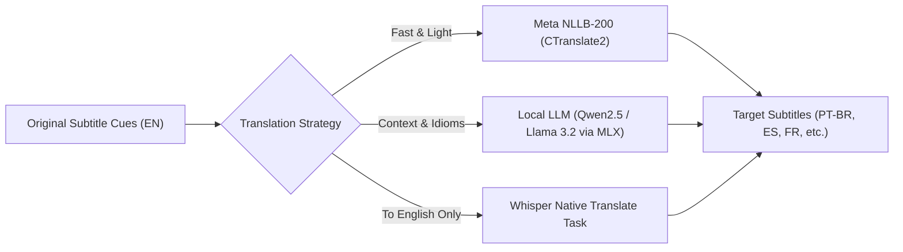

# Project Specification: `capcap` (Captain Caption)

**Version:** 0.2.0 (Draft)  
**Author / Maintainer:** Matheus Buniotto Aguilar  
**Tagline:** *Zero-cloud, lightning-fast local video captioning, translation & native container muxing.*

---

## 1. Executive Summary & Vision

`capcap` (*Captain Caption*) is a lightweight, local-first utility designed to automatically generate accurate subtitles, perform offline multi-language translations, and embed them directly into video files (movies, lectures, series, clips) without relying on external cloud APIs or third-party servers.

### The Problem
- **Privacy & Bandwidth:** Uploading large video files (100MB – 4GB+) to cloud transcription services is slow, costly, and breaches privacy.
- **QuickTime / macOS Incompatibility:** Standard media players on macOS (QuickTime Player, iOS devices) do not automatically load sidecar `.srt` files; they require subtitles to be embedded as native Apple `mov_text` tracks inside the MP4 container.
- **Manual Overhead:** Generating subtitles, aligning timestamps, correcting formatting, and running `ffmpeg` commands manually for every video is tedious and repetitive.
- **CLI Barrier for Non-Technical Users:** Most open-source AI transcription tools require command-line knowledge, Python virtual environments, and terminal commands that average users find intimidating.

### The Solution
`capcap` provides both a developer-friendly CLI and a **dead-simple, zero-terminal UI for everyday users**. It runs entirely on device (accelerated by Apple Silicon / Metal), handles multi-language offline translation, and produces self-contained videos ready to play in QuickTime with a single drag-and-drop.

---

## 2. Core Features & Capabilities

1. **100% Local Inference:**
   - Powered by OpenAI Whisper models running on device (`tiny`, `base`, `small`, `medium`, `large-v3-turbo`).
   - Hardware-accelerated: `mlx-whisper` (Metal on Apple Silicon) with fallback to `faster-whisper` (CTranslate2).
2. **Offline Multi-Language Translation:**
   - Translate speech into different languages (e.g. English audio into Portuguese, Spanish, or French subtitles).
   - Embed multiple subtitle tracks simultaneously in the same video container (e.g., Track 1: Original English, Track 2: Legendas em Português).
3. **Dead-Simple Non-Coder UI:**
   - Drag-and-drop desktop application (Tauri / native macOS) and macOS Finder Quick Action.
   - Zero terminal, zero configuration required.
4. **Native QuickTime & Apple Ecosystem Ready:**
   - Automatically muxes subtitles directly into `.mp4` / `.mov` containers using `mov_text`.
   - Generates clean standalone `.srt` sidecars alongside the video for players like VLC/IINA.
   - Zero re-encoding: video and audio streams are copied directly in milliseconds (`-c copy`).
5. **Smart Audio Preprocessing & VAD:**
   - Silero VAD (Voice Activity Detection) filters out background noise, music, and silence to eliminate Whisper hallucinations and repetitive timestamp loops.
6. **Natural Line Breaking & Reading Cadence:**
   - Enforces max Characters Per Line (CPL, ~37-42 chars) and max reading speed (~17-20 Characters Per Second).
7. **Multi-mode Operation:**
   - **Simple GUI:** Drag video file into the window -> choose language -> click Start.
   - **Finder Quick Action:** Right-click any video -> "Caption with Captain Caption".
   - **CLI & Folder Watcher:** For automated power-user workflows and batch processing.

---

## 3. High-Level Architecture & Pipeline



---

## 4. Local Machine Translation Pipeline

For translating subtitles without sending data to Google Translate or OpenAI cloud APIs, `capcap` integrates a modular offline translation pipeline:



### Translation Options:

| Engine | Ideal Use Case | Speed | Resource Footprint | Supported Languages |
| :--- | :--- | :--- | :--- | :--- |
| **Whisper `task=translate`** | Foreign audio -> English subtitles | Built-in (0 extra ms) | Same as STT | 99+ -> English only |
| **Meta NLLB-200 (via CTranslate2)** | Any-to-Any language (e.g. English -> Portuguese) | Extremely fast (~100 lines/sec on CPU/Metal) | ~600MB - 1.2GB RAM | 200+ languages |
| **Local LLM (Qwen2.5-3B / Llama-3.2-3B via MLX)** | High-context translation (dialogue, slang, jokes) | High (~30-50 tokens/sec on Apple Silicon) | ~2.5GB RAM | Major languages |

### Multi-Track Container Muxing:
When translation is enabled, `capcap` embeds **both** tracks into the MP4 file:
- `Stream #0:2 (eng)`: English (Original Audio)
- `Stream #0:3 (por)`: Português (Legenda Traduzida)

In QuickTime Player or iOS, the user simply clicks the subtitle icon and chooses between:
- `Off`
- `English`
- `Português`

---

## 5. UI/UX Design for Non-Coders (Everyday Users)

Regular users shouldn't need to know what a terminal, Python environment, or `ffmpeg` command is. `capcap` specifies three zero-code interfaces:

### A. Drag-and-Drop Desktop App (The Main GUI)
*Built with **Tauri + Svelte/Tailwind** (or **SwiftUI**) for a lightweight (<20MB), instant-launch native macOS application.*

```
+-------------------------------------------------------------+
|  ⚓ Captain Caption                                       _ O X |
+-------------------------------------------------------------+
|                                                             |
|   +-----------------------------------------------------+   |
|   |                                                     |   |
|   |             📥 Drag & Drop Video Here               |   |
|   |                                                     |   |
|   |         or [ Browse Files... ]                      |   |
|   |                                                     |   |
|   |   Supported: .mp4, .mov, .mkv, .avi, .m4v           |   |
|   +-----------------------------------------------------+   |
|                                                             |
|   Language Options:                                         |
|   [x] Transcribe Original Audio  (Auto-detect)              |
|   [x] Also Translate To: [ Portuguese (Brasil)  v ]         |
|                                                             |
|   Model Quality:                                            |
|   (o) Balanced (Fast & Accurate)   ( ) Ultra-Fast   ( ) Max |
|                                                             |
|   =======================================================   |
|   Progress: [████████████████████░░░░░░░] 74% - Translating |
|   =======================================================   |
|                                                             |
|   [ ▶ Open in QuickTime ]     [ 📁 Reveal in Finder ]       |
+-------------------------------------------------------------+
```

#### User Flow:
1. **Drop:** User drags any movie or video file into the window.
2. **Choose (Optional):** App auto-detects language; user can pick a translation language (e.g. *Português*) from a friendly dropdown.
3. **Go:** User clicks **Start** (or auto-starts on drop).
4. **Watch:** Clean progress bar shows: *Extracting Audio* -> *Transcribing* -> *Translating* -> *Embedding*.
5. **Enjoy:** Once finished, the app chimes and shows two buttons: **"Open in QuickTime"** and **"Show in Finder"**.

---

### B. macOS Finder "Quick Action" (Context Menu)
Users can caption videos without even opening an app window:
1. User right-clicks any video file in macOS Finder.
2. Under **Quick Actions** / **Services**, clicks:  
   👉 **"Caption with Captain Caption"** (or **"Legendary Video"**).
3. A native macOS notification appears:  
   *`🎬 Captioning "01. Course Introduction.mp4"...`*
4. When finished, a notification banners:  
   *`✅ Done! Subtitles embedded into "01. Course Introduction.mp4". Click to play.`*

---

### C. macOS Menu Bar Drop Target
- A clean anchor icon `⚓` lives in the macOS top status bar.
- Users can drag a video from Finder and drop it directly onto the menu bar icon.
- A small popover displays the current queue and progress percentage.

---

## 6. Technical Stack Breakdown

| Component | Technology | Rationale |
| :--- | :--- | :--- |
| **Core Engine** | Python 3.11+ / Rust | Speed, cross-platform stability, native Metal bindings. |
| **STT Model** | `mlx-whisper` (Metal) / `faster-whisper` | Unified Apple Silicon memory, 8-10x real-time inference. |
| **Translation** | Meta NLLB-200 (CTranslate2) / Whisper | 100% offline, low latency, no API keys or internet needed. |
| **VAD Engine** | Silero VAD | Eliminates silence hallucinations and loops. |
| **Container Muxing**| `ffmpeg` (`mov_text` copy) | 0ms video re-encoding, native Apple QuickTime subtitle track. |
| **Desktop GUI** | Tauri (Rust + Web frontend) or SwiftUI | Ultra-low RAM (<35MB), tiny download size, native Mac aesthetics. |
| **CLI Framework**| Typer + Rich | Color-coded terminal UI for scriptable workflows. |

---

## 7. Command-Line Interface (CLI) Reference

```bash
# Basic transcription (replaces with subtitled MP4 + keeps .srt)
capcap run "movie.mp4"

# Transcribe and add Portuguese translation track
capcap run "movie.mp4" --translate-to pt

# Multi-language simultaneous embedding
capcap run "movie.mp4" --lang en --translate-to pt,es

# Run headless folder watcher
capcap watch ~/Movies/ToProcess --translate-to pt

# Launch the simple non-coder graphical interface
capcap gui
```

---

## 8. Implementation Roadmap

- [x] **Milestone 1: Core Transcription & QuickTime Muxer (CLI MVP)**
  - Extraction + `mlx-whisper` + basic `.srt` output + `mov_text` atomic muxing.
- [ ] **Milestone 2: Subtitle Cadence & VAD**
  - Silero VAD segmentation; smart reading speed line breaking (CPL/CPS).
- [ ] **Milestone 3: Local Offline Translation Module**
  - Integration of NLLB-200 (CTranslate2) and Whisper `task=translate`.
  - Multi-track muxing (simultaneous original + translated subtitle streams).
- [ ] **Milestone 4: Easy Drag-and-Drop GUI (Desktop App)**
  - Native macOS drag-and-drop window with language selectors, progress bar, and QuickTime launcher.
- [ ] **Milestone 5: macOS Finder Quick Action & Menu Bar App**
  - Right-click Finder integration and menu bar drop target with native macOS notifications.
